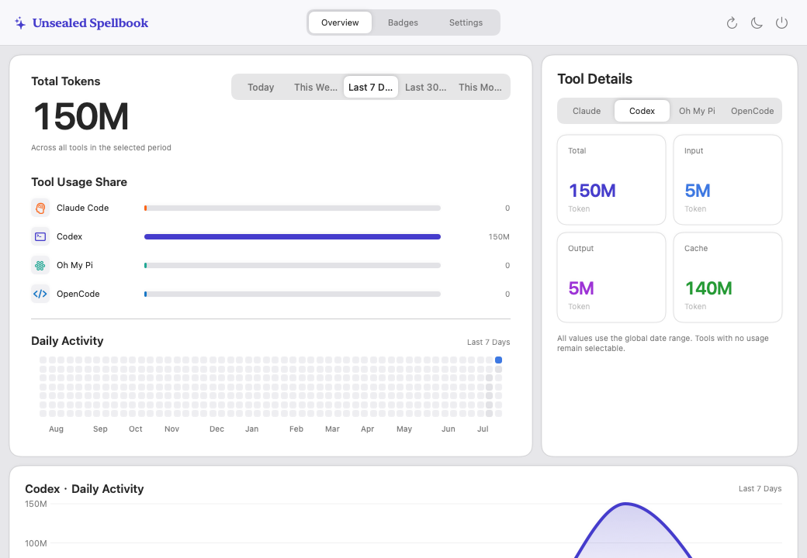
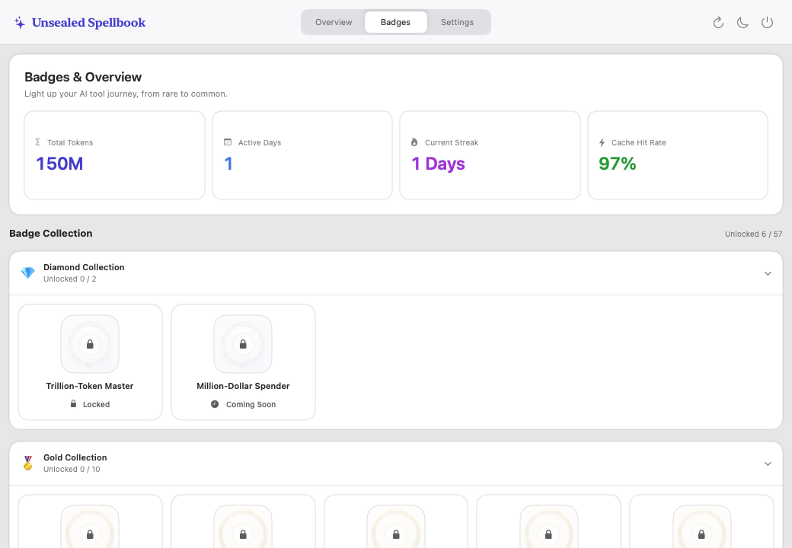
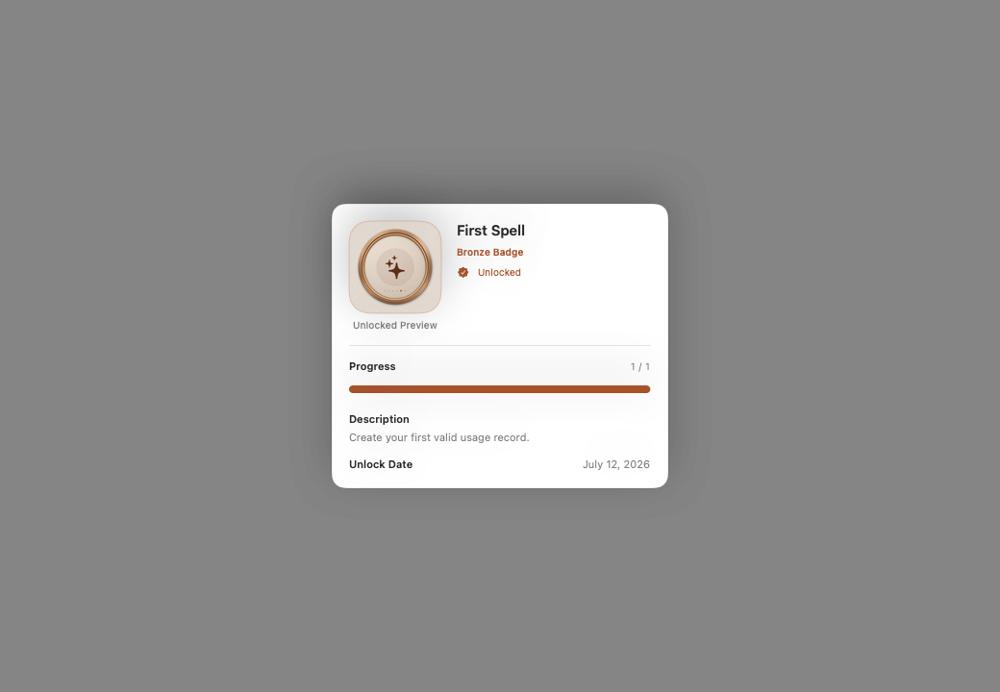
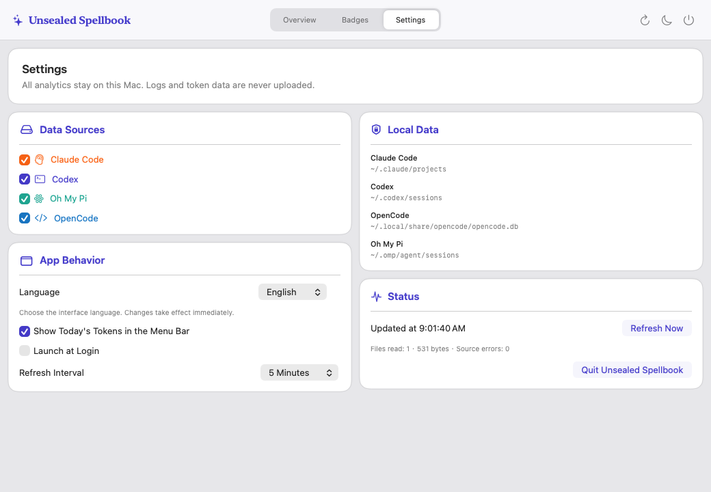

<h1 align="center">Unsealed Spellbook</h1>

<h3 align="center">A macOS AI IDE &amp; Tokens statistics tool for multi LLM models</h3>

<p align="center">
  [<strong>English</strong>] &nbsp;|&nbsp; [<a href="README_zh.md">简体中文</a>]
</p>

<p align="center">
  
</p>

---

Unsealed Spellbook is a private, native macOS Token analytics tool for AI tools and models. Its menu-bar dashboard combines usage from Claude Code, Codex, Oh My Pi and OpenCode, then turns it into clear trends, model rankings and a 60-badge achievement system.

Requires macOS 14 or later.

## Part I — Product overview

### At a glance

- Compare total Token usage across five local-calendar periods: Today, This Week, Last 7 Days, Last 30 Days and This Month.
- Break usage down by tool, input, output and cache activity.
- Explore a 52-week activity grid and a daily trend chart for each supported tool.
- Rank today's models by exact model identity and reasoning variant, with record counts and cache hit rates.
- Track all-time activity, streaks and badge progress without sending logs to a server.
- Refresh manually or every 1, 5 or 15 minutes, launch at login, and switch between light and dark appearances.

### Screens and interaction

Left-click the menu-bar wand to open or close the dashboard. Right-click it to open Settings directly. The menu-bar item can optionally show today's compact Token total. Within the dashboard, use the three tabs to move between Overview, Achievements and Settings; the toolbar also provides refresh, appearance and quit controls.

<table>
  <tr>
    <td width="50%" valign="top">
      
      <br><strong>Overview.</strong> Compare total and per-tool usage across five local-calendar time ranges.
    </td>
    <td width="50%" valign="top">
      
      <br><strong>Achievements.</strong> Browse the 57 visible badges across Diamond, Gold, Silver and Bronze tiers.
    </td>
  </tr>
  <tr>
    <td width="50%" valign="top">
      
      <br><strong>Badge details.</strong> Inspect the requirement, current progress and recorded unlock date.
    </td>
    <td width="50%" valign="top">
      
      <br><strong>Settings.</strong> Choose local sources, language, refresh cadence, login behaviour and menu-bar display.
    </td>
  </tr>
</table>

### Dashboard detail

The Overview presents:

- total usage and each tool's contribution;
- per-tool Total, Input, Output and Cache figures;
- a daily activity heat map and selected-tool trend chart; and
- today's model ranking, keeping model names and reasoning variants separate.

The Achievements page presents all-time Total Tokens, Active Days, Current Streak and Cache Hit Rate. Badge collections are ordered from Diamond to Bronze and can be collapsed. Selecting a badge opens its requirement, progress and unlock record; newly unlocked badges are announced in a dismissible carousel.

### Supported local sources

| Tool | Default location | Source |
| --- | --- | --- |
| Claude Code | `~/.claude/projects` | Recursive JSONL session logs |
| Codex | `~/.codex/sessions` | Recursive JSONL session logs |
| Oh My Pi | `~/.omp/agent/sessions` | Recursive JSONL session logs |
| OpenCode | `~/.local/share/opencode/opencode.db` | SQLite database |

Assistant usage records are normalised into input, output, cache-read, cache-write, reasoning and total Token figures. Where available, the app also retains the tool, backend, exact model name and reasoning variant for aggregation.

Each source can be enabled or disabled independently. Disabled sources are not scanned.

### Languages

The interface can be changed in Settings between:

- Simplified Chinese (`zh-Hans`);
- Traditional Chinese (`zh-Hant`); and
- English (`en-US`).

The app's English interface uses US English; this README uses British English.

### Privacy and performance

All collection and analysis take place on the Mac. The app does not upload logs, require account credentials or persist prompts, responses or raw conversations. Only normalised usage events are retained after parsing. Preferences, acknowledged badge identifiers and badge unlock records are stored locally in `UserDefaults`.

Collection is designed to remain lightweight:

- JSONL files are fingerprinted and read incrementally from their last known offsets; unchanged files are not read again.
- Reads use 256 KiB chunks and a 512 KiB per-line ceiling. An oversized record is rejected without hiding valid records that follow it.
- Replaced, truncated and deleted files are reconciled, and duplicate usage events are collapsed by tool and event identifier.
- OpenCode is opened with SQLite read-only and query-only modes. Database and WAL fingerprints avoid unnecessary repeat queries.
- A failing source does not prevent other sources from being collected; file, byte and source-error diagnostics remain visible in Settings.

### Build and run

The project uses Swift 6 and Swift Package Manager. A complete Xcode installation is recommended so the Swift toolchain and macOS SDK agree.

```sh
swift build
swift test
```

Build an ad-hoc signed development app in `dist/` without launching it:

```sh
./script/build_and_run.sh --build
```

Build and launch the menu-bar app:

```sh
./script/build_and_run.sh
```

Build, launch and verify that the process is running:

```sh
./script/build_and_run.sh --verify
```

## Part II — The badge system

The catalogue contains **60 badges**: **57 are visible**, **50 have live criteria**, **7 are marked coming soon**, and **3 are hidden reserved Diamond slots**.

### Catalogue

| Tier | Total | Live criteria | Coming soon | Hidden | Visible |
| --- | ---: | ---: | ---: | ---: | ---: |
| Bronze | 30 | 28 | 2 | 0 | 30 |
| Silver | 15 | 13 | 2 | 0 | 15 |
| Gold | 10 | 8 | 2 | 0 | 10 |
| Diamond | 5 | 1 | 1 | 3 | 2 |
| **Total** | **60** | **50** | **7** | **3** | **57** |

### Live unlock dimensions

Badge progress is calculated from all-time usage currently included by the enabled sources.

| Dimension | Requirements |
| --- | --- |
| First activity and total volume | First valid usage record; 10M, 100M, 500M, 1B, 5B, 10B, 100B and 1T total Tokens |
| Token composition | 100M non-cached input; 100M and 1B output; 50M and 1B reasoning; 100M, 1B and 10B cache-read Tokens |
| Daily and weekly intensity | Any calendar day at 100M, 1B or 10B Tokens; 5 or 10 days each at 100M or more; any calendar week at 5B Tokens |
| Continuity | Longest streak of 3, 7, 14, 30 or 100 days; 14, 30, 60, 180, 365 or 1,000 active days; activity in 4 distinct calendar weeks or 4 distinct calendar months |
| Tool breadth | 2 or 3 tools each at 100M Tokens; all 4 tools each at 1B or 10B Tokens |
| Model breadth | 3 or 10 known model identities each at 10M Tokens; 25 known model identities each at 100M Tokens; 3 reasoning variants each at 10M Tokens |
| Cache efficiency | 25% hit rate with a 100M sample; 40% with 500M; 60% with 10B; 75% with 100B |
| Record count | 100 and 1,000 valid usage records |

For cache badges, the sample is `input + cache read + cache write`, and the hit rate is `cache read / sample`. Both the rate and minimum sample requirement must be met.

Exact model identities remain distinct by tool, backend, model name and reasoning variant where those fields are available.

### Coming soon and reserved badges

The seven visible coming-soon badges reserve criteria for:

- estimated focus time at 100, 1,000 and 5,000 hours; and
- equivalent API cost at US$1,000, US$10,000, US$100,000 and US$1,000,000.

Three additional Diamond slots are hidden and reserved for future criteria.

### Unlock dates and persistence

When the app first observes that a live criterion has been met, it stores the badge identifier, criteria version, observed value and current date. The displayed unlock date is therefore the date Unsealed Spellbook first recorded the completed criterion; it may differ from the historical date on which the underlying usage actually crossed the threshold.

Once recorded, an unlock remains visible even if a source is later disabled or its local log is removed. Coming-soon and hidden badges cannot unlock.

## Contributing and licence

See [AGENTS.md](AGENTS.md) for repository structure, development commands and contribution guidance. Unsealed Spellbook is available under the [MIT Licence](LICENSE).
