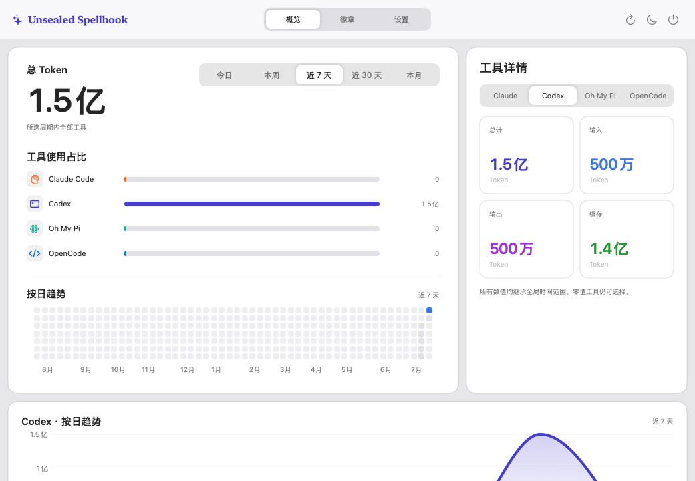
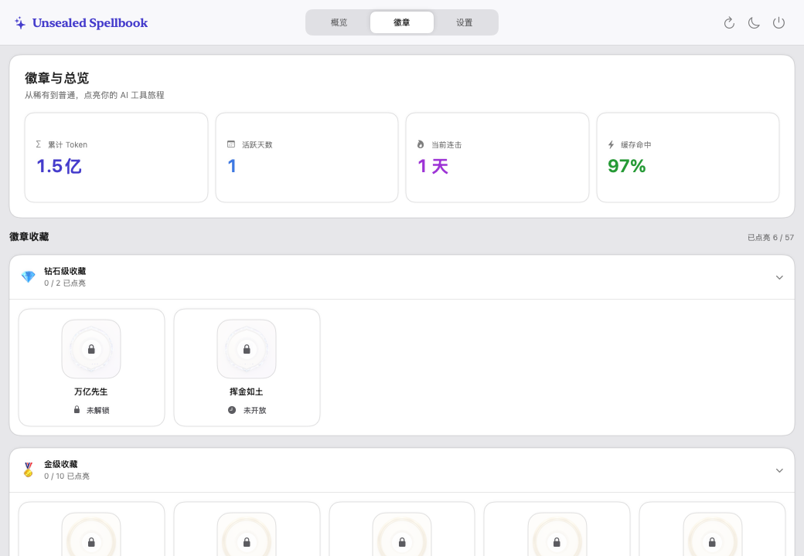
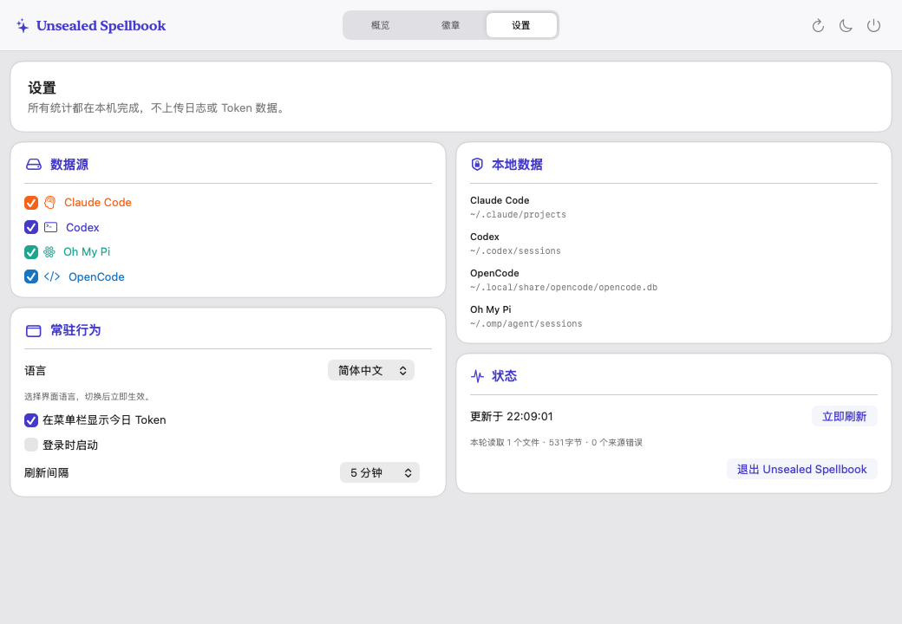

<h1 align="center">Unsealed Spellbook</h1>

<h3 align="center">A macOS AI IDE &amp; Tokens statistics tool for multi LLM models</h3>

<p align="center">
  [<a href="README.md">English</a>] &nbsp;|&nbsp; [<strong>简体中文</strong>]
</p>

<p align="center">
  
</p>

---

Unsealed Spellbook 是一款私密、原生的 macOS 菜单栏应用，用于统计和分析 AI 工具与模型的 Token 使用情况。它汇总 Claude Code、Codex、Gemini CLI、Oh My Pi 和 OpenCode 的本地用量，并将数据转化为清晰的趋势、预估费用、模型排行和一套包含 60 枚徽章的成就系统。

需要 macOS 14 或更高版本。应用界面支持简体中文、繁体中文和美式英语。

## 第一部分——产品概览

### 核心功能

- 按今天、本周、最近 7 天、最近 30 天和本月五个本地日历周期，对比 Token 用量或预估美元费用。
- 按工具、输入、输出和缓存活动拆分用量。
- 查看 52 周活跃度方阵图，以及各受支持工具的按日趋势图。
- 按精确的模型标识和推理等级统计当天的模型排行，同时展示记录数和缓存命中率。
- 无需将日志发送至服务器，即可追踪累计用量、活跃天数、连续使用天数和徽章进度。
- 支持手动刷新或每 1、5、15 分钟自动刷新、开机启动、GitHub 新版本检查及浅色、深色外观切换。

### 页面与交互

左键点击菜单栏魔杖图标可打开或关闭面板，右键点击可直接进入设置。菜单栏项目可选择显示当天的精简 Token 总量。面板内可通过三个标签页在“概览”“徽章”和“设置”之间切换；工具栏还提供刷新、外观切换和退出操作。

<table>
  <tr>
    <td width="50%" valign="top">
      
      <br><strong>概览。</strong>按五个本地日历时间范围，对比总用量及各工具用量。
    </td>
    <td width="50%" valign="top">
      
      <br><strong>徽章。</strong>浏览钻石、黄金、白银和青铜四个等级的 57 枚可见徽章。
    </td>
  </tr>
  <tr>
    <td width="50%" valign="top">
      
      <br><strong>徽章详情。</strong>查看解锁条件、当前进度和记录的解锁日期。
    </td>
    <td width="50%" valign="top">
      
      <br><strong>设置。</strong>选择本地数据源、语言、刷新频率、版本检查、开机启动和菜单栏显示方式。
    </td>
  </tr>
</table>

### 仪表盘详情

“概览”页面展示：

- Token 总用量或预估费用及各工具的占比；
- 各工具的总量、输入、输出和缓存数据；
- 每日活跃度方阵图和所选工具的趋势图；以及
- 当天的模型排行，其中模型名称和推理等级分别统计。

“徽章”页面展示历史 Token 总量、活跃天数、当前连续使用天数和缓存命中率。徽章收藏按钻石、黄金、白银、青铜的顺序排列，并支持折叠。点击徽章可查看解锁条件、进度和解锁记录；新解锁的徽章会通过可关闭的轮播弹窗提示。

### 支持的本地数据源

| 工具 | 默认位置 | 数据来源 |
| --- | --- | --- |
| Claude Code | `~/.claude/projects` | 递归读取 JSONL 会话日志 |
| Codex | `~/.codex/sessions` | 递归读取 JSONL 会话日志 |
| Gemini CLI | `~/.gemini/tmp`、`~/.gemini/gemini-cli/conversations` | JSONL 日志与旧版 JSON 会话 |
| Oh My Pi | `~/.omp/agent/sessions` | 递归读取 JSONL 会话日志 |
| OpenCode | `~/.local/share/opencode/opencode.db` | SQLite 数据库 |

助手用量记录会被标准化为输入、输出、缓存读取、缓存写入、推理和 Token 总量。在数据可用时，应用还会保留工具、后端、准确模型名称和推理等级，用于聚合统计。

每个数据源都可以单独启用或停用。停用的数据源不会被扫描。

费用估算使用模型全名与内置静态价格表精确匹配；未知模型仍会显示，但不会被推测计价。详见[计费规则与公式](docs/pricing.md)。估算结果不能替代供应商账单。

### 语言

可在“设置”中切换以下界面语言：

- 简体中文（`zh-Hans`）；
- 繁体中文（`zh-Hant`）；以及
- 英语（美国）（`en-US`）。

### 隐私与性能

所有数据收集和分析均在 Mac 本地完成。应用不会上传日志，不需要账户凭据，也不会持久化提示词、回复或原始对话。解析后仅保留标准化的用量事件。偏好设置、已确认的徽章标识和徽章解锁记录存储在本地 `UserDefaults` 中。

数据收集以轻量运行为目标：

- JSONL 文件通过指纹识别，并从上次记录的偏移量增量读取；未变化的文件不会被再次读取。
- 每次读取使用 256 KiB 数据块，单行上限为 512 KiB。超限记录会被拒绝，但不会影响其后的有效记录。
- 旧版 Gemini JSON 会话设有 8 MiB 整文件上限；未变化或已判定超限的文件不会被反复读取。
- 应用会处理文件替换、截断和删除，并按工具及事件标识合并重复用量事件。
- OpenCode 数据库以 SQLite 只读和仅查询模式打开；数据库及 WAL 指纹可避免不必要的重复查询。
- 单个数据源失败不会阻止其他数据源的收集；文件数、读取字节数和数据源错误诊断可在“设置”中查看。
- 启用版本检查后，每天最多发起一次轻量 GitHub API 请求；更新仅从项目固定的 Releases 页面手动下载和安装。

### 构建与运行

项目使用 Swift 6 和 Swift Package Manager。建议安装完整的 Xcode，以确保 Swift 工具链与 macOS SDK 版本一致。

```sh
swift build
swift test
```

在 `dist/` 中构建经过临时签名的开发版应用，但不启动：

```sh
./script/build_and_run.sh --build
```

构建并启动菜单栏应用：

```sh
./script/build_and_run.sh
```

构建、启动并确认进程正在运行：

```sh
./script/build_and_run.sh --verify
```

## 第二部分——徽章系统

徽章目录共包含 **60 枚徽章**：其中 **57 枚可见**、**50 枚已有生效的解锁条件**、**7 枚标记为即将推出**，另有 **3 个隐藏的钻石徽章预留位**。

### 徽章目录

| 等级 | 总数 | 生效条件 | 即将推出 | 隐藏 | 可见 |
| --- | ---: | ---: | ---: | ---: | ---: |
| 青铜 | 30 | 28 | 2 | 0 | 30 |
| 白银 | 15 | 13 | 2 | 0 | 15 |
| 黄金 | 10 | 8 | 2 | 0 | 10 |
| 钻石 | 5 | 1 | 1 | 3 | 2 |
| **总计** | **60** | **50** | **7** | **3** | **57** |

### 已生效的解锁维度

徽章进度根据当前已启用数据源所包含的全部历史用量计算。

| 维度 | 解锁要求 |
| --- | --- |
| 首次活动与总用量 | 首条有效用量记录；Token 总量达到 10M、100M、500M、1B、5B、10B、100B 和 1T |
| Token 构成 | 非缓存输入达到 100M；输出达到 100M 和 1B；推理达到 50M 和 1B；缓存读取达到 100M、1B 和 10B |
| 每日与每周强度 | 任意自然日达到 100M、1B 或 10B Token；分别有 5 天或 10 天单日达到 100M；任意自然周达到 5B Token |
| 连续性 | 最长连续使用达到 3、7、14、30 或 100 天；活跃天数达到 14、30、60、180、365 或 1,000 天；覆盖 4 个不同自然周或 4 个不同自然月 |
| 工具广度 | 2 个或 3 个工具分别达到 100M Token；全部 4 个工具分别达到 1B 或 10B Token |
| 模型广度 | 3 个或 10 个已知模型标识分别达到 10M Token；25 个已知模型标识分别达到 100M Token；3 个推理等级分别达到 10M Token |
| 缓存效率 | 缓存命中率达到 25% 且样本量达到 100M；40% 且达到 500M；60% 且达到 10B；75% 且达到 100B |
| 记录数量 | 100 条和 1,000 条有效用量记录 |

对于缓存类徽章，样本量为“输入 + 缓存读取 + 缓存写入”，命中率为“缓存读取 ÷ 样本量”。命中率和最低样本量要求必须同时满足。

在相关字段可用时，准确模型标识会按工具、后端、模型名称和推理等级分别统计。

### 即将推出与预留徽章

7 枚可见的“即将推出”徽章为以下条件预留：

- 预计专注时长达到 100、1,000 和 5,000 小时；以及
- 等值 API 成本达到 1,000、10,000、100,000 和 1,000,000 美元。

另有 3 个钻石徽章位处于隐藏状态，为未来条件预留。

### 解锁日期与持久化

当应用首次检测到某项已生效条件达成时，会存储徽章标识、条件版本、观测值和当前日期。因此，页面显示的是 Unsealed Spellbook 首次记录该条件完成的日期，可能与历史用量实际越过阈值的日期不同。

解锁一经记录，即使之后停用数据源或删除本地日志，仍会保持可见。“即将推出”和隐藏徽章无法解锁。

## 参与贡献与许可证

仓库结构、开发命令和贡献说明请参阅 [AGENTS.md](AGENTS.md)。Unsealed Spellbook 基于 [MIT 许可证](LICENSE) 开源。
